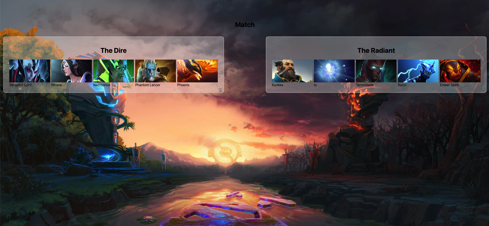

# Full Stack Interview Question

`You're up to a challenge to develop a small full stack web-app in several hours.
It is **OK** not to finish everything on time, but be sure to prioritize your work and understand all the requirements.`

This project goes to production in 2 hours.
You need to prioritize in such a way that you will ship **something**.
because **something** is always better than **Nothing**.

`If ​​we ​​ship ​​nothing, ​​we ​​failed. ​​If ​​we ​​ship something,​​ we ​​might ​​be​​ just ​​ok ​​;)
​​Make​​ smart​​ design​​ and ​​time​​ decisions!` 

## Requirements

### Background
**Dota 2** is a multiplayer online battle arena (MOBA) video game and is the most-played game on Steam.
Dota 2 is a team-oriented game pitting 2 teams (The Dire vs The Radiant) of 5 players (heroes) against each other (5vs5). You win the game by destroying the enemy's Ancient building before they destroy yours.

#### 
Each player controls a **unique** Hero which means that there to be only 1 of a specific hero in a game.
####
Each hero has unique stats, Spells.

## The Goal
We will have one main screen where we see the heroes that were randomly selected to the match.
Every refresh of the screen should randomly picked heores for the match.

## Directions
1. You need to write all parts of this app, from server to client code, including the integration.
2. Don't​ ​use​ ​a​ database ​if​ ​possible.​ ​If​ ​using​ ​one,​ ​choose​ ​the​ ​simplest​ ​option.
3. Keep​ ​your​ ​solution​ ​simple.
4. Please​ ​make​ ​sure​ ​your​ ​final​ ​app​ ​looks​ ​as​ ​in​ ​the​ ​accompanying​ ​designs (ignore color and sizes).
5. Your​ ​app​ ​should​ ​run​ ​only​ ​(!!)​ ​on​ ​the​ ​laptop​ ​you're​ ​using.​ ​Don't​ ​worry​ ​about​ ​any​ ​other​ ​envs, devices​ ​or​ ​scaling.
6. Prioritize​ ​your​ ​work.​ ​If​ ​you​ ​don't​ ​make​ ​it​ ​one​ ​time​ ​-​ ​it's​ ​fine.​ ​Make​ ​sure​ ​you​ ​get​ ​the​ ​most​ ​of​ ​it.
7. Use​ ​any​ ​Frontend​ ​technology​ ​you​ ​like,​ ​be​ ​sure​ ​your​ ​can​ ​explain​ ​why​ ​you​ ​chose.​

## Mockup
### Screen Sizes
We support 3 different width screen (max-width): 600, 1200 and above.
make the screen a responsive as possible. (see attached images as reference below)

## Team Selection constrains
- Each team should include `2` heroes with a role of `Support`
- Each team should include `1` hero with a role of `Carry`
- Each team should include `1` hero with a role of `Nuker`
- Each team should include `1` hero with a role of `Disabler`

## Some tip before you start
1. There is an open api to fetch heroes data.
2. There is an endpoint which you can manipulate your data to fetch the heroes images (if he does not exists in your api that you found).
3. Good luck
4. Have fun.

